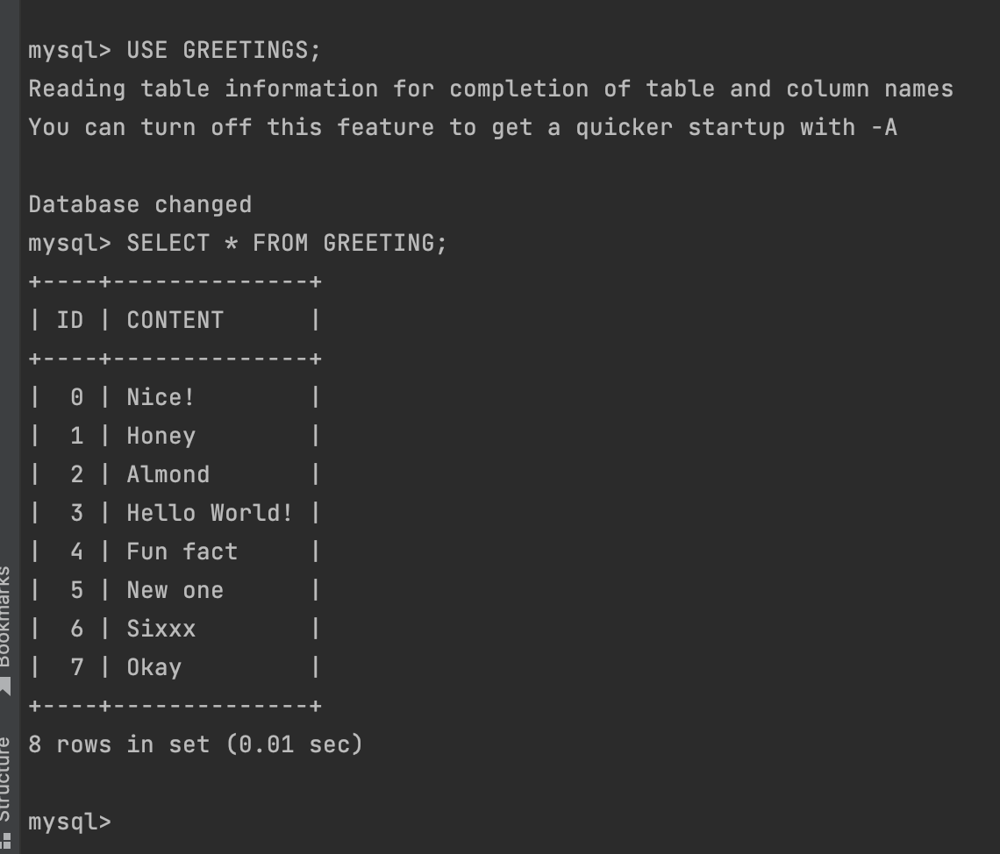

Java Agent Example
=====================

### Setup
This is a Spring Boot Java application which uses thymeleaf to serve html files and a small Mysql database if you 
require persistence. You will need JDK8 and Gradle 8 or newer installed locally to run this, as well as Mysql. 

It also assumes you want to verify on Staging.  If that is not true, check
`build.gradle` for instructions on how to point at production.

Please specify the following variables in your .zshrc or .bashrc or manually in terminal:

```
You may need to specify where the correct version of Java is located on your system:
export JAVA_HOME=`/usr/libexec/java_home -v 18.0.2` 

export NEW_RELIC_LICENSE_KEY=YOUR_LICENSE_KEY
export NEW_RELIC_JAR='/Users/YOUR_DIRECTORY/newrelic-java-agent/newrelic-agent/build/newrelicJar/newrelic.jar'
export NEW_RELIC_API='/Users/YOUR_DIRECTORY/newrelic-java-agent/newrelic-api/build/libs/newrelic-api-#.##.#-SNAPSHOT.jar'
```

### Run the App

Then run the Spring Boot app:

`./gradlew bootRun`

### Run the Database (These instructions are NOT for Production. They're for TESTING ONLY)

1. Check if you have Mysql already installed by opening a terminal shell and running `mysql --version`
2. If not, install it, if so, move on to the next step.
3. To start the mysql instance `mysql.server start`
4. Once started create a database `create database GREETINGS;`
5. Create a user `create user 'USER_NAME' identified by 'YOUR_PASSWORD';`
6. Grant all rights and privileges ` grant all on GREETINGS.* to 'USER_NAME';`
7. To open the editor enter `mysql`
8. To edit the database `use GREETINGS;`
9. Create a table `create table GREETING (ID INT PRIMARY KEY, NAME VARCHAR(25));`
10. Create a row for proof of concept `INSERT INTO GREETING (ID, NAME) VALUES (1, 'Honey');`
11. It worked! `SELECT * FROM GREETING;`

12. fyi: To stop the mysql instance `mysql.server stop`

Now when you go to http://localhost:8080/greeting you can enter information, check it in the database and on staging.
